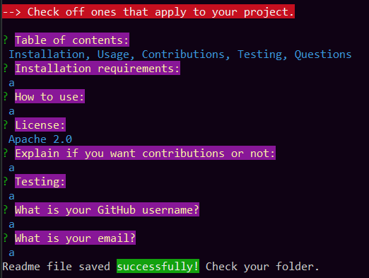

# Professional README Generator

## Description

This is a command-line application that generates high-quality README.md files for projects. It prompts the user for information about the project repository and generates a professional README.md file with selectable sections such as installation, usage, license, contribution, tests, and questions.

## Screenshot

## Installation

To install the README Generator, follow these steps:

1. Clone the repository: `git clone git@github.com:YggdrasilJL/readme-gen.git`
2. Navigate to the project directory.
3. Install the dependencies: `npm install`

## Usage

To use the README Generator, run the following command inside the "Develop" directory:

    npm index.js

Answer the prompts with the appropriate information about your project to generate the README.md file.

## Contribution

Contributions are welcome!

# Credits

This project was created by Jacob Lowther.

